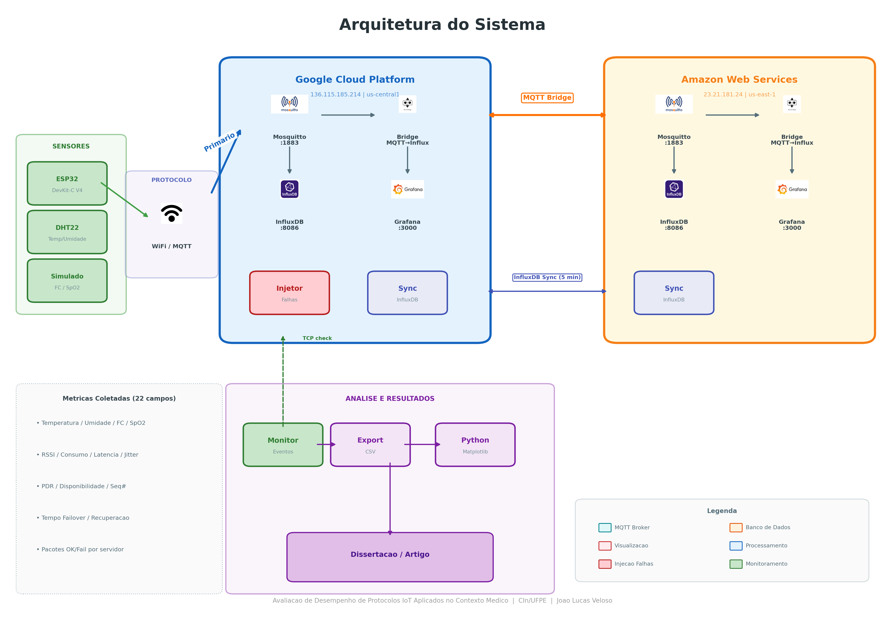
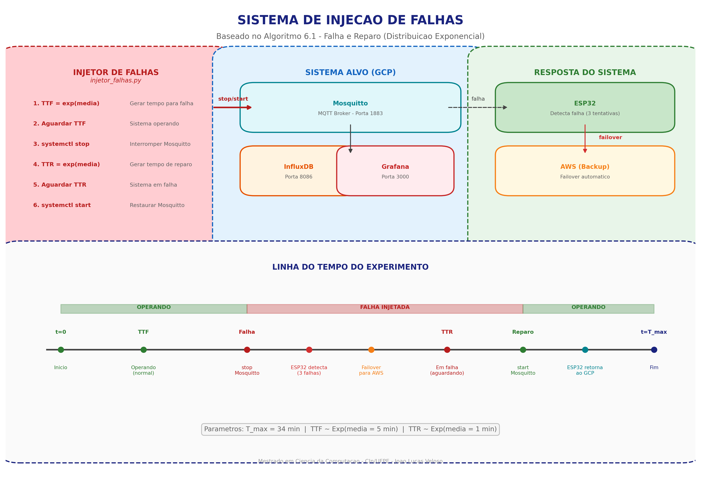
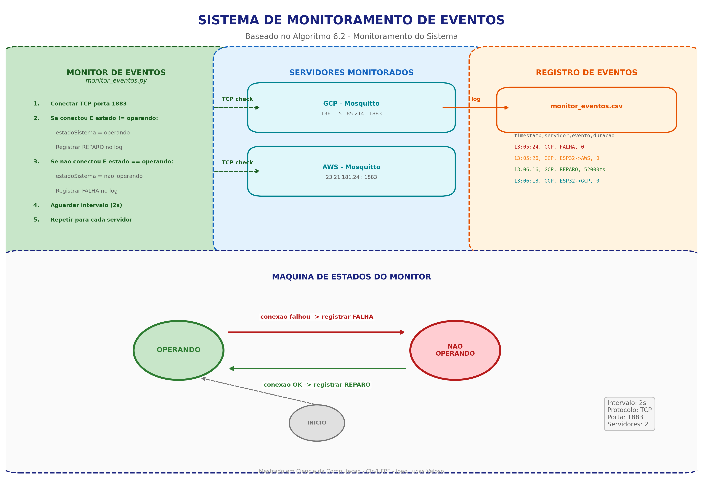
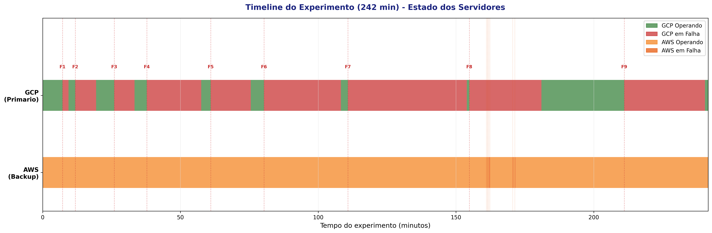
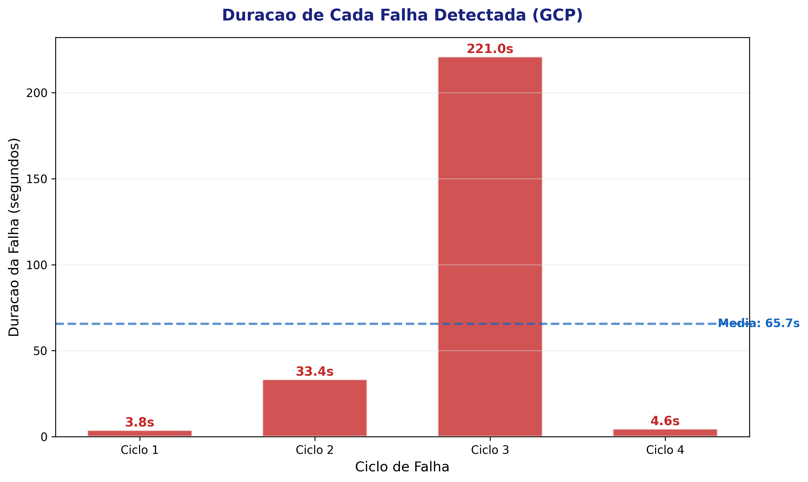
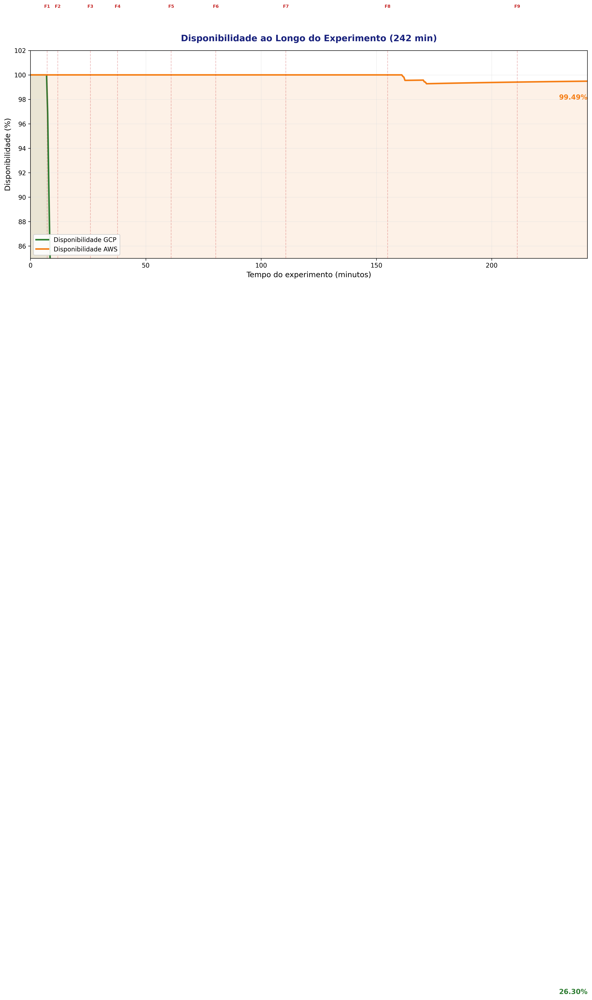
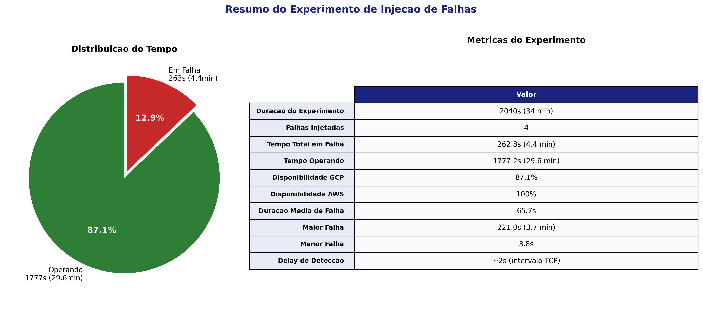

# Avaliacao de Desempenho de Protocolos IoT Aplicados no Contexto Medico

**Mestrado em Ciencia da Computacao - CIn/UFPE**
**Joao Lucas Veloso | Orientador: Prof. Eduardo Tavares | Coorientador: Thiago Valentim**

---

## Sobre o Projeto

Este projeto implementa uma arquitetura IoT para monitoramento de dados de saude em tempo real, com foco na **avaliacao de desempenho de protocolos de comunicacao** (WiFi, LoRaWAN) aplicados no contexto medico, a partir de metricas de desempenho e confiabilidade.

A solucao utiliza um ESP32 com sensor DHT22 que coleta dados de temperatura e umidade, transmitindo via MQTT para uma infraestrutura **multi-cloud (GCP + AWS)** com:

- **Failover automatico** entre servidores MQTT
- **Replicacao bidirecional** de dados via MQTT Bridge
- **Injecao de falhas programatica** para validacao de resiliencia
- **Monitoramento de eventos** com registro de falhas e reparos
- **Metricas avancadas de confiabilidade**: jitter, disponibilidade, tempo de failover/recuperacao, deteccao de duplicatas

---

## Arquitetura



---

## Componentes

### Camada de Sensores
| Componente | Descricao |
|---|---|
| **ESP32 DevKit-C V4** | Microcontrolador com WiFi integrado |
| **DHT22** | Sensor de temperatura e umidade |
| **GPIO4** | Pino de dados do DHT22 |

### Protocolo de Comunicacao
| Protocolo | Status |
|---|---|
| **WiFi 802.11** | Implementado |
| **LoRaWAN** | Futuro |

### Infraestrutura Cloud (Multi-Cloud com IPs Estaticos)
| Servico | Descricao | GCP (136.115.185.214) | AWS (23.21.181.24) |
|---|---|---|---|
| **Mosquitto** | Broker MQTT | Porta 1883 | Porta 1883 |
| **Python Bridge** | MQTT to InfluxDB | Rodando | Rodando |
| **InfluxDB** | Time Series DB | Porta 8086 | Porta 8086 |
| **Grafana** | Dashboard | Porta 3000 | Porta 3000 |
| **MQTT Bridge** | Replicacao bidirecional | Configurado | Configurado |

---

## Metricas Coletadas

O ESP32 envia dados em **InfluxDB Line Protocol** via MQTT com **22 campos**:

```
metricas_iot,protocolo=WiFi,dispositivo=ESP32_Real,localizacao=UTI-01,cloud=GCP
  temperatura=21.7,umidade=69.0,freq_cardiaca=77,saturacao_o2=97,
  rssi=-66,consumo_ma=160.0,latencia=23,
  pacotes_enviados=10928,pacotes_confirmados=10926,
  dht_simulado=0,failovers=2,
  seq=10928,jitter=3,disponibilidade=99.85,
  tempo_failover=3200,tempo_recuperacao=62000,
  ok_gcp=9500,ok_aws=1426,fail_gcp=6,fail_aws=0
```

### Metricas de Sensores
| Metrica | Fonte | Descricao |
|---|---|---|
| `temperatura` | DHT22 (real) | Temperatura ambiente em Celsius |
| `umidade` | DHT22 (real) | Umidade relativa em % |
| `freq_cardiaca` | Simulado | Frequencia cardiaca (bpm) |
| `saturacao_o2` | Simulado | Saturacao de oxigenio (%) |

### Metricas de Desempenho
| Metrica | Fonte | Descricao |
|---|---|---|
| `rssi` | ESP32 (real) | Intensidade do sinal WiFi (dBm) |
| `consumo_ma` | Estimativa | Consumo energetico (mA) |
| `latencia` | ESP32 (real) | Tempo de envio MQTT (ms) |
| `jitter` | ESP32 (real) | Variacao absoluta entre latencias consecutivas (ms) |
| `pacotes_enviados` | ESP32 (real) | Total de pacotes TX |
| `pacotes_confirmados` | ESP32 (real) | Total de pacotes confirmados (PDR) |

### Metricas de Confiabilidade
| Metrica | Fonte | Descricao |
|---|---|---|
| `disponibilidade` | ESP32 (real) | % do tempo em que o sistema esta operando |
| `tempo_failover` | ESP32 (real) | Tempo da deteccao da falha ate reconexao no backup (ms) |
| `tempo_recuperacao` | ESP32 (real) | Tempo da falha ate retorno ao servidor primario (ms) |
| `failovers` | ESP32 (real) | Numero total de trocas de servidor |
| `seq` | ESP32 (real) | Numero sequencial para deteccao de duplicatas/gaps |
| `ok_gcp` / `ok_aws` | ESP32 (real) | Pacotes confirmados por servidor |
| `fail_gcp` / `fail_aws` | ESP32 (real) | Falhas de conexao por servidor |
| `dht_simulado` | ESP32 | 0 = dado real, 1 = fallback simulado |

---

## Failover Automatico

O ESP32 implementa failover automatico entre GCP e AWS:

1. **Conexao primaria**: Google Cloud Platform (136.115.185.214)
2. **Apos 3 falhas consecutivas**: troca para AWS (23.21.181.24), mede `tempo_failover`
3. **A cada 60 segundos**: tenta reconectar ao servidor primario
4. **Retorno automatico**: quando GCP volta, reconecta e mede `tempo_recuperacao`
5. **Disponibilidade**: calculada continuamente como `(tempo_operando / tempo_total) * 100`

### MQTT Bridge (Replicacao)

As VMs possuem **MQTT Bridge** bidirecional, garantindo que dados enviados para uma VM sejam replicados para a outra em tempo real. Topicos replicados:
- `iot-saude-mestrado/#`
- `hospital/#`

---

## Injecao de Falhas



O script `injetor_falhas.py` roda na GCP e simula falhas no broker MQTT baseado no **Algoritmo 6.1 (Falha e Reparo)**, utilizando distribuicao exponencial para gerar tempos aleatorios de:

- **TTF (Time To Failure)**: tempo ate a proxima falha (media configuravel, default 5min)
- **TTR (Time To Repair)**: tempo de duracao da falha (media configuravel, default 1min)

```
sudo python3 injetor_falhas.py --tempo-max 34 --ttf-media 300 --ttr-media 60
```

O injetor para o servico Mosquitto (`systemctl stop`) para simular a falha e reinicia (`systemctl start`) para simular o reparo, registrando todos os eventos em CSV.

---

## Monitoramento de Eventos



O script `monitor_eventos.py` monitora o estado dos brokers MQTT (GCP e AWS) via TCP check e registra transicoes de estado baseado no **Algoritmo 6.2 (Monitoramento do Sistema)**:

```
python3 monitor_eventos.py --intervalo 2 --log monitor_eventos.csv
```

Gera CSV com: `timestamp, servidor, evento, duracao_falha_ms, estado_gcp, estado_aws`

---

## Resultados dos Experimentos

### Timeline do Experimento



### Duracao das Falhas



### Disponibilidade ao Longo do Tempo



### Resumo do Experimento



---

## Pseudocodigos e Diagramas (Artigo)

A pasta `artigo/` contem assets para o artigo cientifico:

| Arquivo | Descricao |
|---|---|
| `01_arquitetura_multicloud.png` | Diagrama da arquitetura multi-cloud com failover e replicacao |
| `02_injecao_falhas.png` | Diagrama do sistema de injecao de falhas com linha do tempo |
| `03_monitoramento_eventos.png` | Diagrama do sistema de monitoramento com maquina de estados |
| `04_timeline_experimento.png` | Timeline dos estados dos servidores durante o experimento |
| `05_duracao_falhas.png` | Grafico de barras com duracao de cada falha injetada |
| `06_disponibilidade.png` | Grafico de disponibilidade do sistema ao longo do tempo |
| `07_resumo_experimento.png` | Resumo com grafico pizza e tabela de metricas |
| `pseudocodigos.tex` | 3 algoritmos em LaTeX: Failover Multi-Cloud, Injecao de Falhas, Monitoramento |
| `diagrama_arquitetura.md` | Diagramas em Mermaid: arquitetura completa, fluxo de dados, sequencia de falha |

---

## Estrutura dos Arquivos

```
esp32-iot-saude/
├── esp32-iot-saude.ino      # Firmware ESP32 (failover + 22 metricas)
├── injetor_falhas.py        # Injecao de falhas (Algoritmo 6.1)
├── monitor_eventos.py       # Monitoramento de eventos (Algoritmo 6.2)
├── mqtt_to_influx_aws.py    # Python Bridge (MQTT -> InfluxDB) para AWS
├── setup-aws.sh             # Script de instalacao da stack na EC2 AWS
├── sync_influx.py           # Sync de dados entre InfluxDBs (gap-filling)
├── check_sync.py            # Verificacao de consistencia entre InfluxDBs
├── setup_grafana.py         # Configuracao automatica do Grafana via API
├── gerar_graficos_analise.py # Gera graficos de analise dos experimentos
├── pinagem.txt              # Referencia de pinagem ESP32 + DHT22
├── gerar_diagramas.py       # Gera diagramas PNG para o artigo (Matplotlib)
├── monitor_eventos.csv      # Log de eventos do experimento
├── README.md
├── artigo/
│   ├── 01_arquitetura_multicloud.png  # Diagrama de arquitetura
│   ├── 02_injecao_falhas.png          # Diagrama de injecao de falhas
│   ├── 03_monitoramento_eventos.png   # Diagrama de monitoramento
│   ├── 04_timeline_experimento.png    # Timeline dos estados dos servidores
│   ├── 05_duracao_falhas.png          # Duracao de cada falha injetada
│   ├── 06_disponibilidade.png         # Disponibilidade ao longo do tempo
│   ├── 07_resumo_experimento.png      # Resumo do experimento
│   ├── pseudocodigos.tex              # Algoritmos em LaTeX
│   └── diagrama_arquitetura.md        # Diagramas Mermaid
└── dht_scan/
    └── dht_scan.ino         # Utilitario: scanner de GPIOs para DHT22
```

---

## Pinagem - ESP32 + DHT22

```
ESP32 3V3    ---> DHT22 pino 1 (VCC)
ESP32 GPIO4  ---> DHT22 pino 2 (DAT) + resistor 10k pull-up (opcional)
ESP32 GND    ---> DHT22 pino 4 (GND)
```

---

## Como Usar

### Pre-requisitos
- Arduino IDE com suporte ESP32
- Bibliotecas: `PubSubClient`, `DHT sensor library` (Adafruit)
- Python 3 (para injetor e monitor)

### 1. Configurar WiFi
Editar `esp32-iot-saude.ino`:
```cpp
const char* ssid     = "SEU_WIFI";
const char* password = "SUA_SENHA";
```

### 2. Upload para ESP32
1. Conectar ESP32 via USB
2. Selecionar placa: **ESP32 Dev Module**
3. Upload (Ctrl+U)
4. Serial Monitor em 115200 baud

### 3. Executar Experimento com Injecao de Falhas

**Terminal 1** (PC local) - Monitor de eventos:
```bash
python3 monitor_eventos.py --intervalo 2 --log monitor_eventos.csv
```

**Terminal 2** (SSH na GCP) - Injetor de falhas:
```bash
sudo python3 injetor_falhas.py --tempo-max 34 --ttf-media 300 --ttr-media 60
```

**Terminal 3** (Arduino IDE) - Serial Monitor do ESP32 em 115200 baud

### 4. Verificar dados
```bash
# Na VM, ver dados MQTT em tempo real
mosquitto_sub -t "iot-saude-mestrado/#" -v

# Consultar InfluxDB
influx -database iot_medico -execute "SELECT * FROM metricas_iot ORDER BY time DESC LIMIT 5"
```

### 5. Grafana
- GCP: `http://136.115.185.214:3000`
- AWS: `http://23.21.181.24:3000`

---

## IPs Estaticos

| Cloud | IP | Tipo |
|---|---|---|
| **GCP** | 136.115.185.214 | Static External IP |
| **AWS** | 23.21.181.24 | Elastic IP |

Os IPs sao fixos e nao mudam ao parar/ligar as VMs.

---

## Proximos Passos

- [x] Executar experimentos com injecao de falhas (34 min)
- [x] Analise estatistica das metricas (Python/Matplotlib)
- [x] Exportar dados para CSV e gerar graficos para o artigo
- [x] Deploy do script de sincronizacao InfluxDB entre VMs
- [x] Configurar Grafana com todas as metricas
- [ ] Executar experimento longo (4h) com falhas maiores
- [ ] Implementar protocolo LoRaWAN para comparativo
- [ ] Escrita do artigo (14 paginas) com resultados comparativos

---

## Licenca

Projeto academico - Mestrado em Ciencia da Computacao, CIn/UFPE.
