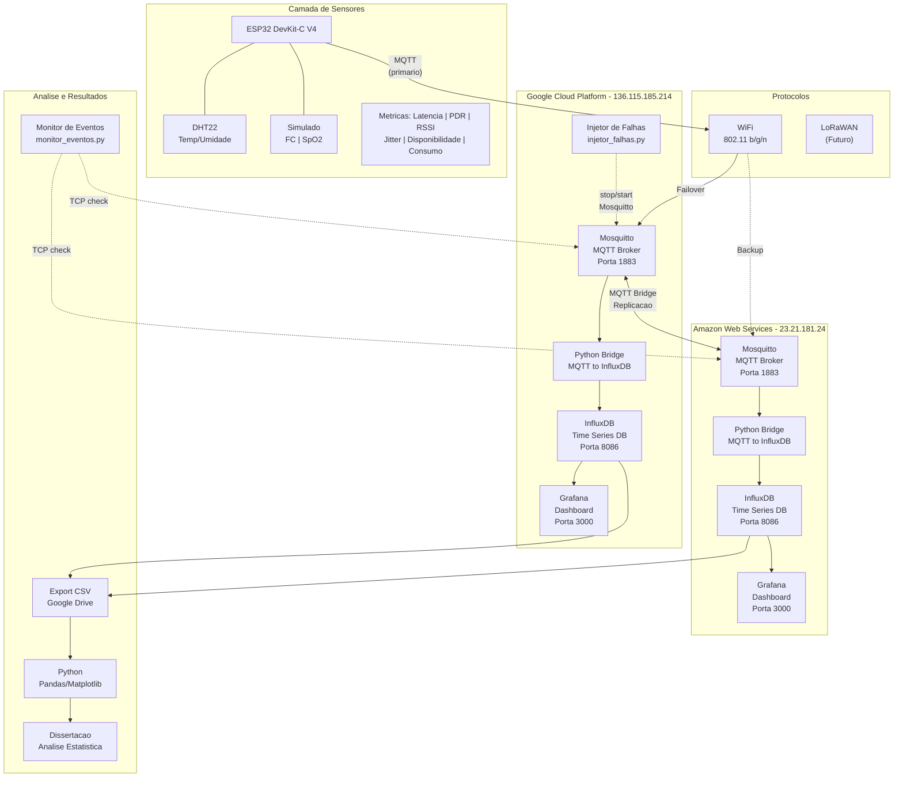
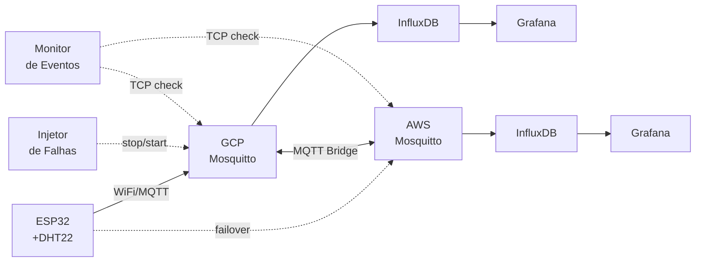
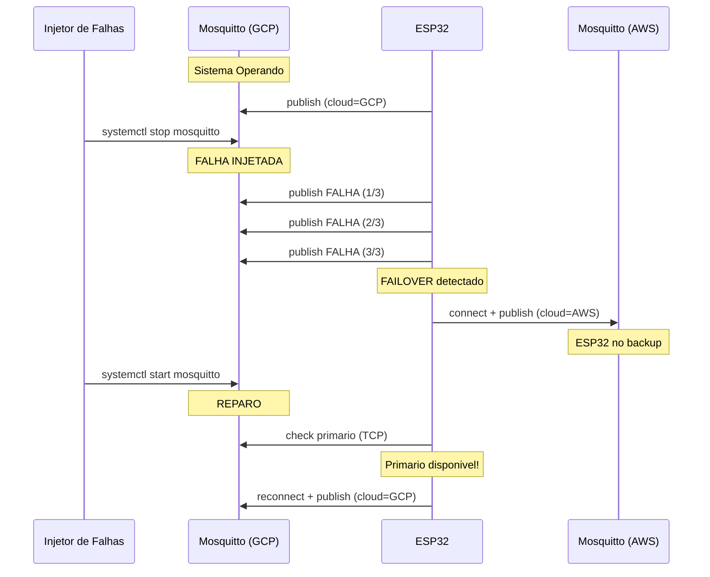

# Diagrama de Arquitetura - IoT Saude Mestrado

## Diagrama completo (para artigo)

Usar este Mermaid para gerar a imagem:

## Diagrama simplificado (fluxo de dados)

## Diagrama de injecao de falhas

